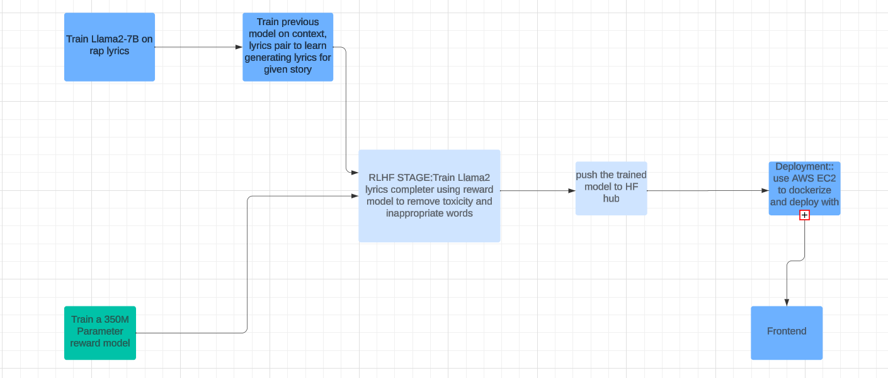

#### RAP-Style Lyrics Generator From Context/Story
 

Enter the realm where storytelling meets rhythmic artistry. Llama-Rapper is an innovative project that transforms ordinary narratives into vibrant rap-style lyrics, leveraging open source LLMs sculpted through a meticulous training process.

Our journey unfolds through distinct stages of refinement:

1. **Llama2 7b's Rap Proficiency:** At the project's inception, the foundation was laid using the robust llama2 7b model, meticulously trained on a vast corpus of rap lyrics sourced from online repositories. This phase marks the immersion into the cadence and lyrical finesse emblematic of rap music.

2. **Contextual Fusion:** Elevating the lyrical journey, we augment the AI's prowess by infusing context with lyrics. Each narrative serves as a guiding force, enabling the AI to craft bespoke verses steeped in the essence of the provided stories.

3. **The Reward Model:** A specialized 350M parameter model takes center stage, honed through extensive training on prevalent hate speech patterns inherent in rap music. This model acts as a guiding beacon, ensuring authenticity while respecting the nuances and cultural aspects of the rap genre.

4. **Refinement through RLHF:** To temper the inherent propensity for undesirable language, the llama2 model undergoes further refinement. The integration of the reward model acts as a vigilant gatekeeper, instilling a sense of responsibility by discouraging the generation of toxic or inappropriate words.
### 

### Project Pipeline
 

 

